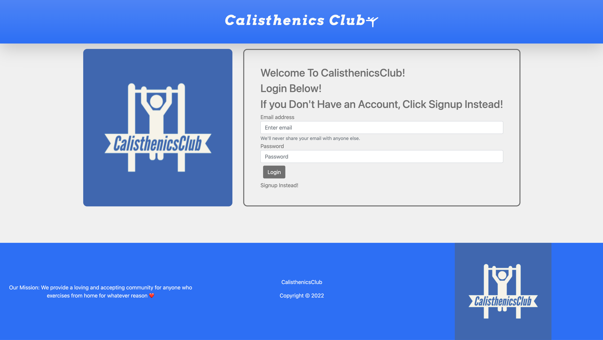

# CalisthenicsClub

## Description
Calisthenics Club is a full stack web application that houses a calisthenics community. It provides the user with a workout tracker, a forums page, and an exercise catalog.

## Built With
* HTML
* CSS
* Javascript
* Bootstrap
* Express.js
* Handlebars.js
* Sequelize
* Animate on scroll library

## Link to Deployed Application
https://tranquil-bastion-94254.herokuapp.com/

## Screenshot of Deployed application

## Note
* The secondary repo contains a skeleton of the html/css @ https://github.com/Osamadahnoun/CalisthenicsClub-HTML-CSS

